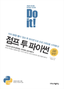

# **Self-Studying with Jump to Python** 

## **Jump to Python** 

Author: 박응용

https://wikidocs.net/book/1

Description
---

I found this book by myself to learn the fundamental knowledges of Python to develop my coding language skill. It is great book to help any korean guys who want to start Python as his first computational languge. I upload my IPython notebook files of book when I made.  

Contents
---
1. What is Python?

	* Characteristics of Python

	* What can Python do?

2. Types, 자료형

	* Numbers

	* Strings

	* Lists

	* Tuples

	* Dictionaries

	* Sets

	* Logics

	* Variables

3. Decision Making and Loops, 제어문

	* If

	* While

	* For

4. Files I/O, 프로그램 입력과 출력

	* functions

	* User I/O

	* Reading and Writing

5. Advance Tutorial, 날개달기

	* Classes

	* Modules

	* Packages

	* Exceptions

	* Built-in functions

	* Non-built-in functions

6. Programming, 프로그래밍

	* How can I build a program?

	* Muliples of 2 and 5?

	* Counting pages on a billboard

	* Simple note

	* Turn tab to 4 spaces

	* Search at sub-directories

	* Codingdojang

7. Reg Expressions and XML, 정규표현식과 XML

	* Intro of RE

	* Start RE

	* To the powerful RE world

	* From Python to XML

